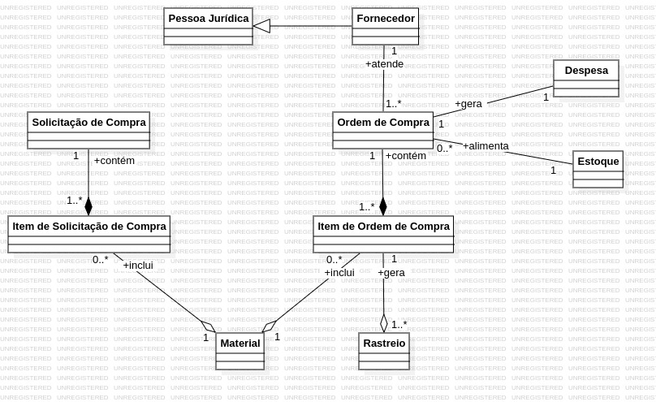

# Diagramas de Classes - Centro Educacional CSI

Diagramas das entidades do sistema e seus relacionamentos (para programadores).

[Voltar para o inicio](README.md)

### Módulo Pessoas

### Módulo Financeiro

### Módulo Estoque

### Módulo Compras

### Módulo Serviços Contratados

### Módulo Projetos e Ações
